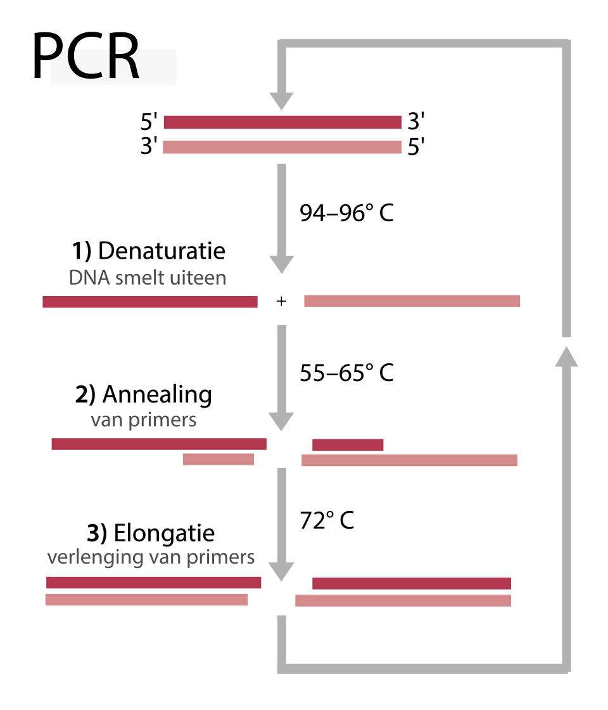

# Introduction

<!-- This is a comment. -->

OBITools is a package that handles metabarcoding dataset. This package have the goal to propose
a entire package that is personalize and adaptable to the biological question, to the dataset
or in our case, a marker ! To do so, the commun tools are unix mimicking based tool, like grep, uniq, etc.
But instead of apply to lines, it applied to sequences. 
General introduction about the topic and then an introduction of the
tutorial (the questions and the objectives). It is nice also to have a
scheme to sum up the pipeline used during the tutorial. The idea is to
give to trainees insight into the content of the tutorial and the (theoretical
and technical) key concepts they will learn.

You may want to cite some publications; this can be done by adding citations to the
bibliography file (`tutorial.bib` file next to your `tutorial.md` file). These citations
must be in bibtex format. If you have the DOI for the paper you wish to cite, you can
get the corresponding bibtex entry using [doi2bib.org](https://doi2bib.org).

With the example you will find in the `tutorial.bib` file, you can add a citation to
this article here in your tutorial like this:
 ``.
This will be rendered like this: , and links to a
[bibliography section](#bibliography) which will automatically be created at the end of the
tutorial.


**Please follow our
[tutorial to learn how to fill the Markdown]({{ site.baseurl }}/topics/contributing/tutorials/create-new-tutorial-content/tutorial.html)**

> <agenda-title></agenda-title>
>
> In this tutorial, we will cover:
>
> 1. TOC
> {:toc}
>
{: .agenda}

# Title for your first section

Give some background about what the trainees will be doing in the section.
Remember that many people reading your materials will likely be novices,
so make sure to explain all the relevant concepts.

## Title for a subsection
Section and subsection titles will be displayed in the tutorial index on the left side of
the page, so try to make them informative and concise!

# Hands-on Sections
Below are a series of hand-on boxes, one for each tool in your workflow file.
Often you may wish to combine several boxes into one or make other adjustments such
as breaking the tutorial into sections, we encourage you to make such changes as you
see fit, this is just a starting point :)

Anywhere you find the word "***TODO***", there is something that needs to be changed
depending on the specifics of your tutorial.

have fun!

## Get data

> <hands-on-title> Data Upload </hands-on-title>
>
> 1. Create a new history for this tutorial
> 2. Import the files from [Zenodo]({{ page.zenodo_link }}) or from
>    the shared data library (`GTN - Material` -> `{{ page.topic_name }}`
>     -> `{{ page.title }}`):
>
>    ```
>    
>    ```
>    ***TODO***: *Add the files by the ones on Zenodo here (if not added)*
>
>    ***TODO***: *Remove the useless files (if added)*
>
>    
>
>    
>
> 3. Rename the datasets
> 4. Check that the datatype
>
>    
>
> 5. Add to each database a tag corresponding to ...
>
>    
>
{: .hands_on}

# Title of the section usually corresponding to a big step in the analysis

It comes first a description of the step: some background and some theory.
Some image can be added there to support the theory explanation:


The idea is to keep the theory description before quite simple to focus more on the practical part.

***TODO***: *Consider adding a detail box to expand the theory*

> <details-title> More details about the theory </details-title>
>
> But to describe more details, it is possible to use the detail boxes which are expandable
>
{: .details}

A big step can have several subsections or sub steps:


## Sub-step with **obipcr**

> <hands-on-title> Carry out the PCR in sillico </hands-on-title>
>
> 1.  with the following parameters:
>    -  *"Input sequences file"*: `output` (Input dataset)
>    - *"Sequence of the forward primer"*: `{'id': 1, 'output_name': 'output'}`
>    - *"Sequence of the reverse primer"*: `{'id': 2, 'output_name': 'output'}`
>    - *"Maximum length of the barcode, primers excluded."*: `{'id': 3, 'output_name': 'output'}`
>    - *"Minimum length of the barcode, primers excluded."*: `{'id': 4, 'output_name': 'output'}`
>    - *"Maximum number of mismatches allowed for each primer"*: `{'id': 5, 'output_name': 'output'}`
>    - *"Choose source of NCBI Taxonomy"*: `Use built-in NCBI Taxonomy database`
>        - *"NCBI Taxonomy database"*: `2024-06-05`
>
>
>    ***TODO***: *Check parameter descriptions*
>
>    ***TODO***: *Consider adding a comment or tip box*
>
>    > <comment-title> How it works </comment-title>
>    >
>    > This step is a in sillico PCR. Thats means this command mimick this molecular method. The output will be sequence that are predicted to be amplified by the PCR, according to the parameter of a specific marker. In this tutorial, we are using a marker that is located on the COI gene, which is a very commun and well known gene to identify animal.
>    {: .comment}
>
{: .hands_on}

> <details-title>More details on the PCR</details-title>
>
> This method, called Polymerase Chain Reaction, is a DNA amplification with specific primers that 
> {: style="width:75%; display:block; margin:auto;"}
{: .details}

***TODO***: *Consider adding a question to test the learners understanding of the previous exercise*

> <question-title></question-title>
>
> 1. Question1?
> 2. Question2?
>
> > <solution-title></solution-title>
> >
> > 1. Answer for question1
> > 2. Answer for question2
> >
> {: .solution}
>
{: .question}

## Sub-step with **obigrep**

> <hands-on-title> Select sequences by his taxonomic rank </hands-on-title>
>
> 1.  with the following parameters:
>    -  *"Input sequences file"*: `output` (output of **obipcr** )
>    - In *"filter parameter"*:
>        -  *"Insert filter parameter"*
>            - *"Choose the sequence record selection option"*: `attribute`
>                - *"Attribute to use as key in key=value."*: `taxid`
>    - *"Choose source of NCBI Taxonomy"*: `Use built-in NCBI Taxonomy database`
>        - *"NCBI Taxonomy database"*: `2024-06-05`
>
>    ***TODO***: *Check parameter descriptions*
>
>    ***TODO***: *Consider adding a comment or tip box*
>
>    > <comment-title> short description </comment-title>
>    >
>    > A comment about the tool or something else. This box can also be in the main text
>    {: .comment}
>
{: .hands_on}

> <details-title>Taxonomic database</details-title>
>
> Add more details in Markdown...
>
{: .details}

***TODO***: *Consider adding a question to test the learners understanding of the previous exercise*

> <question-title></question-title>
>
> 1. Question1?
> 2. Question2?
>
> > <solution-title></solution-title>
> >
> > 1. Answer for question1
> > 2. Answer for question2
> >
> {: .solution}
>
{: .question}

## Sub-step with **obiuniq**

> <hands-on-title> Dereplicate the sequence </hands-on-title>
>
> 1.  with the following parameters:
>    -  *"Input sequences file"*: `output` (output of **obigrep** )
>    - In *"Option and his following attribute"*:
>        -  *"Insert Option and his following attribute"*
>            - *"Use specific option"*: `category_attribute`
>            - *"Attribute"*: `taxid`
>    - *"Choose source of NCBI Taxonomy"*: `No taxonomic database selected`
>
>    ***TODO***: *Check parameter descriptions*
>
>    ***TODO***: *Consider adding a comment or tip box*
>
>    > <comment-title> short description </comment-title>
>    >
>    > A comment about the tool or something else. This box can also be in the main text
>    {: .comment}
>
{: .hands_on}

***TODO***: *Consider adding a question to test the learners understanding of the previous exercise*

> <question-title></question-title>
>
> 1. What is dereplication ?
> 2. Why we need to dereplicate the dataset ?
>
> > <solution-title></solution-title>
> >
> > 1. The dereplication step is to regroup *identical* sequence, in this case by taxid.
> > 2. The dereplication step is a way to reduce the size of the sequence file without remove information
> >
> {: .solution}
>
{: .question}

## Sub-step with **obirefidx**

> <hands-on-title> index the dataset </hands-on-title>
>
> 1.  with the following parameters:
>    -  *"Input sequences file"*: `output` (output of **obiuniq** )
>    - *"Choose source of NCBI Taxonomy"*: `Use built-in NCBI Taxonomy database`
>        - *"NCBI Taxonomy database"*: `2024-06-05`
>
>    ***TODO***: *Check parameter descriptions*
>
>    ***TODO***: *Consider adding a comment or tip box*
>
>    > <comment-title> How it works </comment-title>
>    >
>    > This tool permit to index the dataset by make a alignement sequence per sequence. This command return the same sequence file but put the score of alignement in the annotation of each sequence. Only the best score. 
>    {: .comment}
>
{: .hands_on}


***TODO***: *Consider adding a question to test the learners understanding of the previous exercise*

> <question-title></question-title>
>
> 1. Question1?
> 2. Question2?
>
> > <solution-title></solution-title>
> >
> > 1. Answer for question1
> > 2. Answer for question2
> >
> {: .solution}
>
{: .question}

## Sub-step with **obitag**

> <hands-on-title> Taxonomic assignement </hands-on-title>
>
> 1.  with the following parameters:
>    -  *"Input sequences file"*: `output` (Input dataset)
>    -  *"Parameter file"*: `output` (output of **obirefidx** )
>    - *"Choose source of NCBI Taxonomy"*: `Use built-in NCBI Taxonomy database`
>        - *"NCBI Taxonomy database"*: `2024-06-05`
>
>    ***TODO***: *Check parameter descriptions*
>
>    ***TODO***: *Consider adding a comment or tip box*
>
>    > <comment-title> How it works </comment-title>
>    >
>    > Obitag is the last tool of the workflow, it permit to make the taxonomic assignment by Lowest Common Ancestor (LCA)
>    {: .comment}
>
{: .hands_on}

***TODO***: *Consider adding a question to test the learners understanding of the previous exercise*

> <question-title></question-title>
>
> 1. Question1?
> 2. Question2?
>
> > <solution-title></solution-title>
> >
> > 1. Answer for question1
> > 2. Answer for question2
> >
> {: .solution}
>
{: .question}


## Re-arrange

To create the template, each step of the workflow had its own subsection.

***TODO***: *Re-arrange the generated subsections into sections or other subsections.
Consider merging some hands-on boxes to have a meaningful flow of the analyses*

# Conclusion

Sum up the tutorial and the key takeaways here. We encourage adding an overview image of the
pipeline used.

{: style="width:75%; display:block; margin:auto;"}
